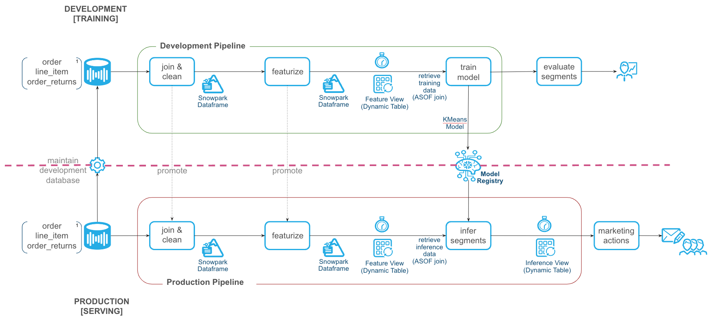

# Getting Started with Snowflake Feature Store

## Overview 

This guide walks you through an end-to-end customer segmentation machine-learning use-case using Snowpark for Python,  Snowflake Feature-Store and Model-Registry, and Snowpark ML.  The primary focus in this guide is the Snowflake Feature Stores functionality and how it integrates within the broader ML eco-system within Snowflake.

By completing this guide, you will be able to go from ingesting raw data through to implementing a production inference data-pipeline to maintain customer segments.

Here is a summary of what you will be able to learn in each step by following this quickstart:

- **Setup Environment**: Use stages and tables to ingest and organize raw data from S3 into Snowflake tables.  Setup a scheduled process to simulate incremental data-ingest into Snowflake tables.
- **Feature Engineering**: Leverage Snowpark for Python DataFrames to perform data cleansing, transformations such as group by, aggregate, pivot, and join to create features the data for machine-learning.
- **Feature Store**: Use Snowflakes feature-store to register and maintain feature-engineering pipelines and understand how to monitor them once operational. 
- **Machine Learning**: Perform feature transformation and run ML Training in Snowflake using Snowpark ML. Register the trained ML model for inference from Snowpark ML Model Registry
- **Operationalise a Model**: Implementing a production inference data-pipeline to maintain customer segments as underlying customer behaviours change in source data.

The diagram below provides an overview of what we will be building in this QuickStart.

## Step-By-Step Guide

For prerequisites, environment setup, step-by-step guide and instructions, please refer to the [QuickStart Guide](https://quickstarts.snowflake.com/guide/getting_started_with_snowflake_feature_store/index.html).
